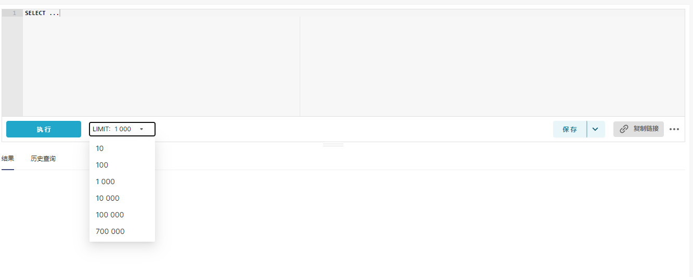

# superset 修改查询limit

<!-- @import "[TOC]" {cmd="toc" depthFrom=1 depthTo=6 orderedList=false} -->

<!-- code_chunk_output -->

- [superset 修改查询limit](#superset-修改查询limit)
  - [创建图表时的limit下拉选项](#创建图表时的limit下拉选项)
    - [修改sql lab中的条数限制](#修改sql-lab中的条数限制)

<!-- /code_chunk_output -->


在superset页面上可以看到几处limit，每个limit的修改方式对应在源码中同的位置

## 创建图表时的limit下拉选项

在创建图表时可以在下来框中选择行限制

  

这里默认只可以选到50000，如果想新增更大的选项，需要修改`superset-frontend/packages/superset-ui-chart-controls/src/shared-controls/sharedControls.tsx`

```py
const ROW_LIMIT_OPTIONS = [10, 50, 100, 250, 500, 1000, 5000, 10000, 50000, 800000];
```

然后重新构建镜像，使这一部分前端代码生效（我是基于helm在k8s部署的）
在构建镜像的过程中，如果有前端报错，可以注释掉 `superset-frontend/webpack.config.js` 中的

```py
  plugins.push(
    // runs type checking on a separate process to speed up the build
    new ForkTsCheckerWebpackPlugin({
      eslint: {
        files: './{src,packages,plugins}/**/*.{ts,tsx,js,jsx}',
        memoryLimit: 4096,
        options: {
          ignorePath: './.eslintignore',
        },
      },
    }),
  );
```

这里修改完后，前端页面就有了新的limit选项。但是在config.py中还限制了最大的查询条数，所以如果下拉菜单中的选项大于这个最大的查询条数，检查图表的查询时会看到仍是以配置中的最大查询条数为准。所以可以将这两个配置设成相同的值

覆盖配置(helm的部署，覆盖配置可以在values中写)：

```py
SQL_MAX_ROW = 800000
```

### 修改sql lab中的条数限制

```py
SQL_MAX_ROW = 700000
```

这个配置也会影响 sqllab查询中的选项，会自动加上这个值作为list中的一个选项

  

