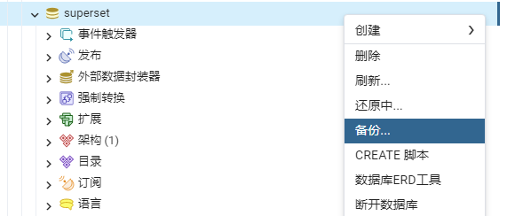
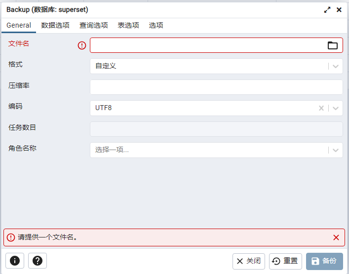
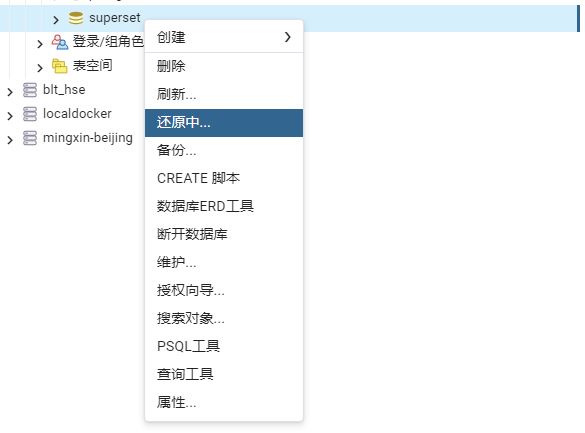

# superset 切换元数据库

<!-- @import "[TOC]" {cmd="toc" depthFrom=1 depthTo=6 orderedList=false} -->

<!-- code_chunk_output -->

- [superset 切换元数据库](#superset-切换元数据库)
  - [备份原数据库](#备份原数据库)
  - [还原原数据库](#还原原数据库)
  - [更新superset helm release](#更新superset-helm-release)

<!-- /code_chunk_output -->

需求是将superset从原本的postgresql1中切换到postgresql2，为了方便，将两个server上的数据库都命名为superset，用户密码都是superset。 superset采用helm chart部署，values配置了postgresql连接方式

## 备份原数据库

使用的pgadmin工具，该工具自带pgdump和pgrestore。右键原server中的superset数据库选择备份

fs  

备份文件，编码注意，文件格式可以.sql或.backup

  

## 还原原数据库

在新的postgresql server中先创建空的数据库superset，然后右键选择还原中，选择备份的文件即可

  

还原过程中可能会提示还原失败，但是查看新superset数据库数据表和sequence都在，应该是可以忽略

## 更新superset helm release

修改superset Values.yaml中的postgresql连接方式，然后helm ugrade。

基础的helm部署superset会包含superset、superset-worker和superset-init-db。helm更新只会更新superset-init-db。此时如果访问superset会提示很多Forbidden报错，需要手动重启一下superset的另两个pod