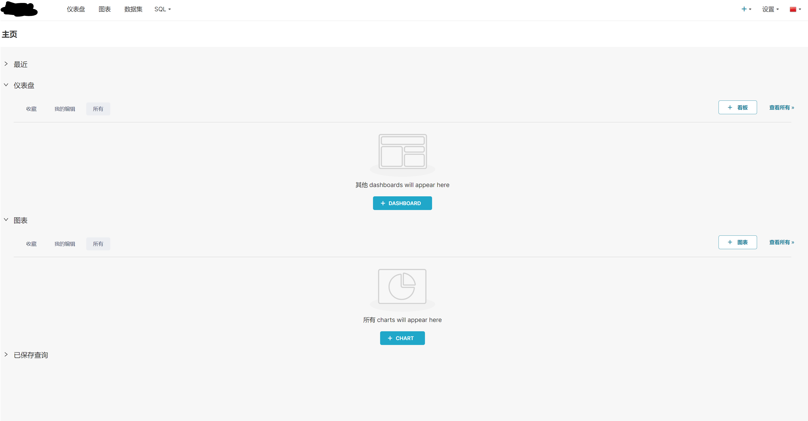

# Superset 汉化

<!-- @import "[TOC]" {cmd="toc" depthFrom=1 depthTo=6 orderedList=false} -->

<!-- code_chunk_output -->

- [Superset 汉化](#superset-汉化)
  - [源码改动](#源码改动)
  - [Dockerfile](#dockerfile)
  - [helm](#helm)

<!-- /code_chunk_output -->


针对源码和helm部署的汉化做一下讲解：

## 源码改动

`superset/config.py`:

修改`BABEL_DEFAULT_LOCALE`

```py
BABEL_DEFAULT_LOCALE = "zh"
```

确认LANGUAGES中有类似如下的内容，并且注释掉 `LANGUAGES = {}`，这个配置会在页面右上角出现小国旗图标，并且只有当注释掉相应内容后，切换国旗才能真正切换语言。注意这里指的切换语言是页面上的静态资源，也就是放在superset/statics中，如下图的对比

  

  


```py
LANGUAGES = {
    "en": {"flag": "us", "name": "English"},
    "es": {"flag": "es", "name": "Spanish"},
    "it": {"flag": "it", "name": "Italian"},
    "fr": {"flag": "fr", "name": "French"},
    "zh": {"flag": "cn", "name": "Chinese"},
    "ja": {"flag": "jp", "name": "Japanese"},
    "de": {"flag": "de", "name": "German"},
    "pt": {"flag": "pt", "name": "Portuguese"},
    "pt_BR": {"flag": "br", "name": "Brazilian Portuguese"},
    "ru": {"flag": "ru", "name": "Russian"},
    "ko": {"flag": "kr", "name": "Korean"},
    "sk": {"flag": "sk", "name": "Slovak"},
    "sl": {"flag": "si", "name": "Slovenian"},
    "nl": {"flag": "nl", "name": "Dutch"},
}

```

在`superset/translations/zh/LC_MESSAGES/`中添加[messages.json](./asset_IMG/superset_chinese/messages.json)和[messages.po](./asset_IMG/superset_chinese/messages.po)两个文件，这两个文件是英文对应的中文描述翻译

然后在根目录下运行：

```sh
pybabel compile -d superset/translations -l zh
```

这个命令会生成`superset/translations/zh/LC_MESSAGES/messages.mo`，这个文件会使得superset完全汉化，包括上面的Dashboards等都会翻译为中文。

## Dockerfile

在Dockerfile lean stage中 添加下面的命令

```docker
RUN pybabel compile -d superset/translations -l zh
```

这个也会实现源码中的效果

## helm

由于docker镜像中已经编译过了，所以只需要添加config.py中的改动即可：

将configOverrides: {}
改为：：

```yaml
configOverrides: 
  my_override: |
    BABEL_DEFAULT_LOCALE = "zh"
    BABEL_DEFAULT_FOLDER = "superset/translations"
    # The allowed translation for you app
    LANGUAGES = {
        "en": {"flag": "us", "name": "English"},
        "zh": {"flag": "cn", "name": "Chinese"},
    }

```