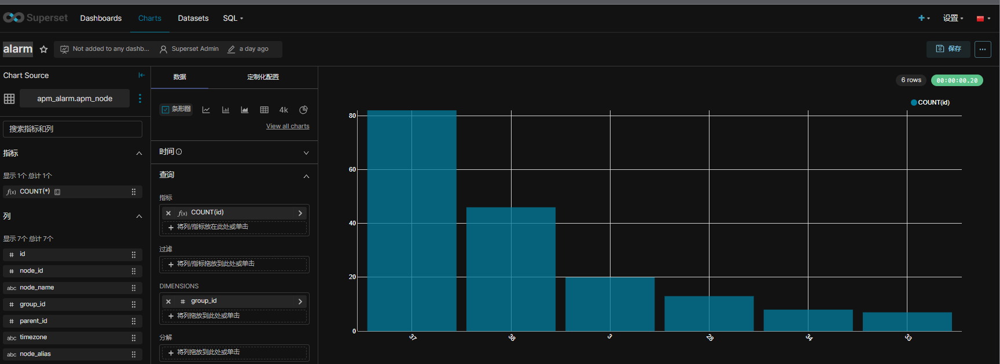
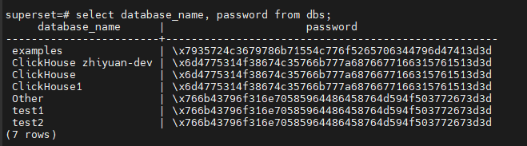

# Superset 部署

<!-- @import "[TOC]" {cmd="toc" depthFrom=1 depthTo=6 orderedList=false} -->

<!-- code_chunk_output -->

- [Superset 部署](#superset-部署)
  - [helm](#helm)
    - [deployment](#deployment)
    - [configuration](#configuration)
      - [修改页面默认显示语言](#修改页面默认显示语言)
  - [Docker-compose](#docker-compose)
    - [添加依赖](#添加依赖)
    - [更新SECRET_KEY](#更新secret_key)

<!-- /code_chunk_output -->

## helm

### deployment

基于helm：

下载chart，我们需要对chart进行一些修改

```sh
helm fetch superset/superset
```

如果不修改可以直接部署

```sh
helm install superset superset
```

### configuration

在部署过程中，superset pod的 生成`/app/pythonpath/superset_config.py`。初始生成的配置比较少，如果需要扩展配置，可以参考[superset可配置的内容](https://github.com/apache/superset/blob/master/superset/config.py#L271)，在values.yaml中进行覆盖. [guide](https://superset.apache.org/docs/installation/running-on-kubernetes/#superset_configpy)

values.yaml：

```yaml
configOverrides: {}
```

#### 修改页面默认显示语言

[显示语言的配置](https://github.com/apache/superset/blob/baf713aad57d2b47827f53857208faf4677f8e2b/superset/config.py#L344C1-L367C2)：

```py
# ---------------------------------------------------
# Babel config for translations
# ---------------------------------------------------
# Setup default language
BABEL_DEFAULT_LOCALE = "en"
# Your application default translation path
BABEL_DEFAULT_FOLDER = "superset/translations"
# The allowed translation for you app
LANGUAGES = {
    "en": {"flag": "us", "name": "English"},
    "es": {"flag": "es", "name": "Spanish"},
    "it": {"flag": "it", "name": "Italian"},
    "fr": {"flag": "fr", "name": "French"},
    "zh": {"flag": "cn", "name": "Chinese"},
    "ja": {"flag": "jp", "name": "Japanese"},
    "de": {"flag": "de", "name": "German"},
    "pt": {"flag": "pt", "name": "Portuguese"},
    "pt_BR": {"flag": "br", "name": "Brazilian Portuguese"},
    "ru": {"flag": "ru", "name": "Russian"},
    "ko": {"flag": "kr", "name": "Korean"},
    "sk": {"flag": "sk", "name": "Slovak"},
    "sl": {"flag": "si", "name": "Slovenian"},
    "nl": {"flag": "nl", "name": "Dutch"},
}
```

所以values.yaml中改为：

```yaml
configOverrides:
  my_override: |
    BABEL_DEFAULT_LOCALE = "zh"
    BABEL_DEFAULT_FOLDER = "superset/translations"
    # The allowed translation for you app
    LANGUAGES = {
        "en": {"flag": "us", "name": "English"},
        "es": {"flag": "es", "name": "Spanish"},
        "it": {"flag": "it", "name": "Italian"},
        "fr": {"flag": "fr", "name": "French"},
        "zh": {"flag": "cn", "name": "Chinese"},
        "ja": {"flag": "jp", "name": "Japanese"},
        "de": {"flag": "de", "name": "German"},
        "pt": {"flag": "pt", "name": "Portuguese"},
        "pt_BR": {"flag": "br", "name": "Brazilian Portuguese"},
        "ru": {"flag": "ru", "name": "Russian"},
        "ko": {"flag": "kr", "name": "Korean"},
        "sk": {"flag": "sk", "name": "Slovak"},
        "sl": {"flag": "si", "name": "Slovenian"},
        "nl": {"flag": "nl", "name": "Dutch"},
    }
```

进行部署即可，效果：

  

## Docker-compose

这种部署方法比较方便用于测试集成新的package。

进入项目根目录(docker-compose-non-dev.yml所在的路径)，运行：

```sh
docker-compose -f docker-compose-non-dev.yml up -d
```

可以参考[官方教程](https://superset.apache.org/docs/installation/installing-superset-using-docker-compose)
[clickhouse例子](https://blog.51cto.com/u_16213635/7471385)

### 添加依赖

创建 `./docker/requirements-local.txt`，可以添加新的python包。自己开发的一些driver包也可以打成whl或tz包放到目录下面引用，例如 创建一个 `./docker/drivers/` 目录用于存放本地打的包
在`./docker/requirements-local.txt`中可以这样写：

```txt
file:./docker/drivers/clickhouse-driver-0.2.0.tar.gz
file:./docker/drivers/clickhouse-sqlalchemy-0.2.4.tar.gz
```

这种方式安装的包在容器中的路径：

```txt
/usr/local/lib/python3.9/site-packages#
```

### 更新SECRET_KEY

我们例子中使用的是non-dev版本的docker-compose，参考官网的说法生产环境下的superset如果想正常使用必须在congig中添加一个SECRET_KEY变量。

docker修改源码中的`docker/pythonpath_dev/superset_config.py`文件，在文件中添加 下面内容（默认没有）

```txt
SECRET_KEY = "xxxxxxxxxxxxxxxxx"
```

SECRET_KEY 的值可以通过 `openssl rand -base64 42`命令生成

有可能我们在开始的时候由于未注意修改数据库造成有些添加的数据库在数据库中使用的是错误的key加密过的password。
可以进入postgresql容器中，使用psql查看

```sh
# 登录superset数据库
psql -d superset -U superset -W
#会提示要求输入password，password是superset

#执行sql查询数据库存储的数据链接
select daabase_name, password from dbs
```

结果例子

  

需要注意的是 docker-compose down命令只会卸载容器，不会删除volume，这种情况下重新up这些数据还存在。如果想彻底清除，需要执行 `docker compose -f docker-compose-non-dev.yml down -v`