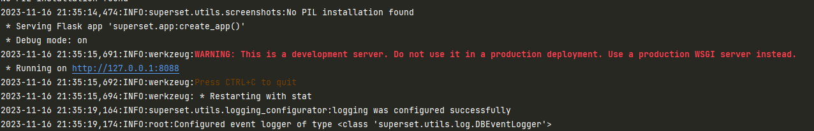

# Superset 本地环境开发调试

<!-- @import "[TOC]" {cmd="toc" depthFrom=1 depthTo=6 orderedList=false} -->

<!-- code_chunk_output -->

- [Superset 本地环境开发调试](#superset-本地环境开发调试)
  - [Windows环境Superset本地开发调试](#windows环境superset本地开发调试)
    - [windows环境安装python](#windows环境安装python)
    - [拉取项目](#拉取项目)
    - [初始化项目](#初始化项目)
      - [创建venv](#创建venv)
      - [安装项目依赖](#安装项目依赖)
      - [安装项目](#安装项目)
      - [修改superset配置](#修改superset配置)
      - [初始化数据库](#初始化数据库)
      - [创建admin用户](#创建admin用户)
      - [初始化Superset](#初始化superset)
      - [运行Superset后端](#运行superset后端)
      - [Superset后端Swagger](#superset后端swagger)
      - [运行前端](#运行前端)

<!-- /code_chunk_output -->


## Windows环境Superset本地开发调试

基于官方源码在windows环境二次开发。本次使用python 9，开发工具Pycharm

参考材料
[1](https://github.com/apache/superset/blob/master/CONTRIBUTING.md#setup-local-environment-for-development)，[2](https://medium.com/@jayakrishnan.karolil_46246/how-to-run-and-debug-apache-superset-using-pycharm-cdc308fc87b2)

### windows环境安装python

### 拉取项目

[源码地址](https://github.com/apache/superset)

### 初始化项目

#### 创建venv

使用pycharm打开项目完整目录，首先我们需要创建项目虚拟环境venv，后续操作都应该在项目的venv中进行。

venv可以通过命令行方式创建：

python3命令： `python3 -m venv venv`, `source venv/bin/activate`
python2使用的是virtualenv，我没有试过，可以通过命令：`pip install virtualenv`

但是pycharm可以为我们创建venv 点击 File-》setting -》 Project -》add Interpreter，选择之后，Pycharm的terminal目录前面会出现(venv) 代表进入了VENV

#### 安装项目依赖

Superset的代码结构将requirements.txt放在根目录的`requirements`文件夹中，里面包含了各种级别的的requirements.txt，彼此有继承关系。本次使用的是testing.txt
在根目录运行：

```sh
pip install -r requirements/testing.txt
```

pip install的时候可能有些包拉不下来。我在Pycharm的设置中配置了代理。当然应该也可以切换包源

#### 安装项目

```sh
pip install -e .
```

这一步成功会日志中提示成功安装了许多东西，其中一项是apache-superset。

#### 修改superset配置 

在`superset/config.py`中需要修改一些配置：

生成一个复杂秘钥：

```sh
openssl rand -base64 42
```

修改SECRET_KEY（必须做）:

```py
SECRET_KEY = <你的负责秘钥>
```

修改SQLALCHEMY_DATABASE_URI：
Superset默认使用的Sqlite数据库，本次我没有修改，但是可以按照注释中的内容改为额外Mysql或Postgres

```py
SQLALCHEMY_DATABASE_URI = "<db sqlalchemy url>"
```

#### 初始化数据库

```superset db upgrade```

#### 创建admin用户

```sh
superset fab create-admin 
```

这一步会提示一些创建admin用户，设置用户名密码

#### 初始化Superset

按照官网提示，会创建默认的role和permission

```sh
superset init
```

#### 运行Superset后端

使用命令行启动Superset：

```sh
superset run -p 8088 --with-threads --reload --debugger --debug
```

成功会在terminal里看到下面这样的日志

  

注意此时前端相关的CSS等内容还没有包含，进入 `http://127.0.0.1:8088` 只能登录，没有什么内容可以查看

这一步也可以通过配置Pycharm启动配置来做
点击RUN -》 Edit Configuration -》 Add New

然后在配置页面配置参数：

Script path：找到项目 `venv\Scripts\superset-script.py`
Paramter: `run -p 8088 --with-threads --reload --debugger --debug`
Evironment新增`FLASK_APP=superset;FLASK_ENV=development`
Python interpreter：如果之前没配置的话就参考上面的先创建venv，然后这里会新增这个项目的venv的Python

Ubuntu环境pycharm的配置方式区别：
Script ：找到项目 `venv/bin/flask.py`
Paramter: `run -p 8088 --with-threads --reload --debugger --debug`
Evironment新增`FLASK_APP=superset;FLASK_ENV=development`

#### Superset后端Swagger

`http://127.0.0.1:8088/swagger/v1`

#### 运行前端

只在ubuntu环境下面成功，windows环境下有报错

进入superset-frontend目录，

安装依赖：

```sh
npm ci
```

运行webpack server

```sh
npm run dev-server
```

访问 localhost:9000 会跳转到superset后端的8088服务端口