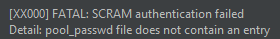
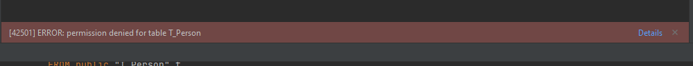

# Postgresql-HA创建新用户，并赋予有限权限

<!-- @import "[TOC]" {cmd="toc" depthFrom=1 depthTo=6 orderedList=false} -->

<!-- code_chunk_output -->

- [Postgresql-HA创建新用户，并赋予有限权限](#postgresql-ha创建新用户并赋予有限权限)
  - [实测](#实测)

<!-- /code_chunk_output -->


在客户环境使用的是基于[bitnami chart](https://artifacthub.io/packages/helm/bitnami-aks/postgresql-ha/9.0.6)部署的postgresql-ha集群模式postgresql。包含pgpool deployment和postgresql statefulset。

现在一个需求是在已部署的postgresql-ha中添加新用户，并且授予该用户个别表的select权限

首先创建用户的sql一般是：

```sql
CREATE USER myuser001 WITH 
LOGIN
NOSUPERUSER
INHERIT
NOCREATEDB
NOCREATEROLE
NOREPLICATION
PASSWORD abcdef
```

注意我们在创建这个用户的时候根据需求授予了ＬＯＧＩＮ这个权限

这个sql语句对于非ha模式的postgresql是有效的。但是ha模式下，虽然可以成功创建用户，但是登录会经过pgpool，而pg_pool中维护了对于通过它请求登录的用户名密码一个文件`pgpool-passwd`。 如果不在这个文件中配置我们创建用户的username password记录，pgpool会拦截登录请求，报错如下：

  

SCRAM是因为postgresql在14版本之后，采用的是SCRAM算法。在之前的版本是md5

可以参考网上一些介绍，
[1](https://www.ucloud.cn/yun/129905.html)

我们可以进入pgpool的容器 运行下面的命令为新用户在`pgpool-passwd`中新增记录，其中.pgpoolkey是默认的加密key的位置：

```sh
 pg_enc -m -k ~/.pgpoolkey -u pgpool -p
```

**但是** 由于一些配置原因，我进入pgpool 容器中运行上面的命令会提示 key not found。此时可以用另一种办法来创建记录

修改helm chart的values.yaml:

将

```yaml
pgpool
  customUsers: {}
```

改为

```yaml
pgpool
  customUsers:
    usernames: "mytestuser1"
    passwords: "abcdefg"
```

这个改动会修改`pgpool_passwd`.

除此之外还需要修改：

```yaml
postgresql:
  pgHbaTrustAll: false
```

改为true. 这个改动会让数据节点允许信任尝试连接他的用户。

然后helm更新postgresql-ha即可。

## 实测

我们给新用户两张测试表的其中一张的select权限：

```sql
GRANT SELECT ON "T_Class" TO testuser3
```

然后用该账号登录，测试另一张T_Person表能否select：

  
