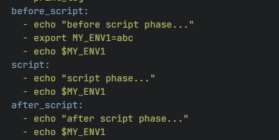
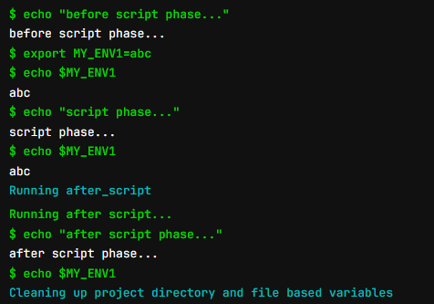

# gitlab ci research

<!-- @import "[TOC]" {cmd="toc" depthFrom=1 depthTo=6 orderedList=false} -->

<!-- code_chunk_output -->

- [gitlab ci research](#gitlab-ci-research)
  - [practice](#practice)

<!-- /code_chunk_output -->

## practice

* 在before_script中定义的环境变量，可以在script中使用，但是在after_script中需要重新定义

      

      
* 
