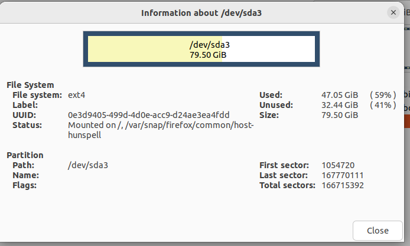

# ubuntu 磁盘扩容

<!-- @import "[TOC]" {cmd="toc" depthFrom=1 depthTo=6 orderedList=false} -->

<!-- code_chunk_output -->

- [ubuntu 磁盘扩容](#ubuntu-磁盘扩容)
  - [背景](#背景)
    - [选择扩容已有分区](#选择扩容已有分区)

<!-- /code_chunk_output -->


## 背景

vmware ubuntu虚拟机需要扩容，在vmware中分配磁盘空间后，进入ubuntu，使用 `df -h`
查看发现没有变化，这是因为还需要将分配给这台虚拟机的磁盘空间进行分区。

### 选择扩容已有分区

可以使用`gparted`命令，会弹出一个ui窗口，在页面上可以为已有分区添加为分配的磁盘空间

如果遇到配报错`unable to resize read only file system ...`, 可以在gparted弹出的窗口中，右键，菜单选择information查看，这个分区挂载的文件目录

  

然后赋予这两个目录读写权限(按照自己的路径修改下面的命令)

```sh
sudo mount -o remount -rw /
sudo mount -o remount -rw /var/snap/firefox/common/host-hunspell
```

然后就可以使用gparted进行分区扩容了