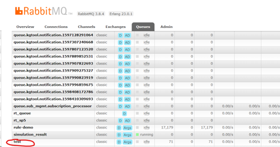
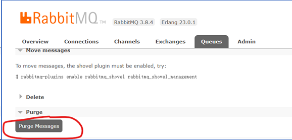
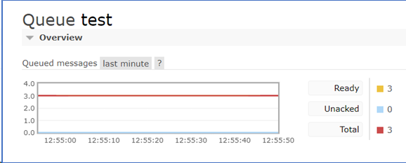
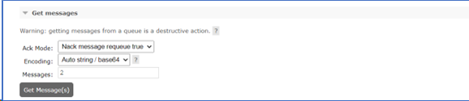
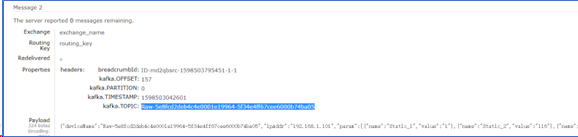

# RabbitMQ

<!-- @import "[TOC]" {cmd="toc" depthFrom=1 depthTo=6 orderedList=false} -->

<!-- code_chunk_output -->

- [RabbitMQ](#rabbitmq)
  - [UI](#ui)

<!-- /code_chunk_output -->

## UI

在rabiitMQ的manage界面，点击queue，查看test topic，查看消息的内容

  

选择test queue进去，先点击purge Message，将之前的数据清掉

  

然后会看到图中ready的数据清零

  

发送数据，点击get message，可以修改要显示的数据量，这可功能目前只能全部显示给定的数据量，不能显示某几条

  

  
