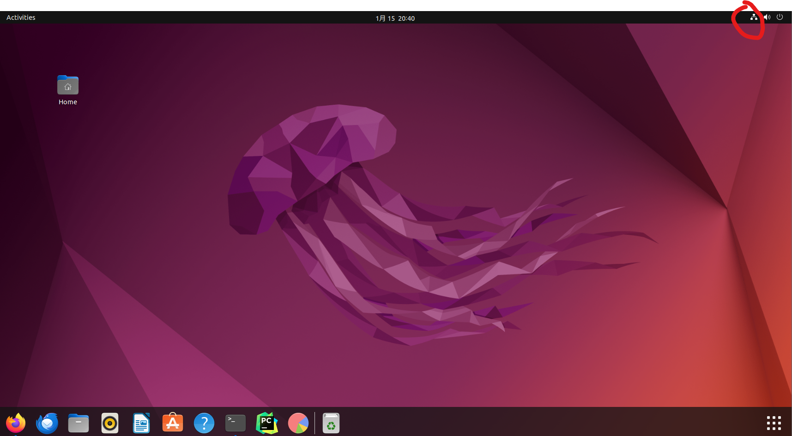

# VMware 上 ubuntu虚拟机无网络链接

<!-- @import "[TOC]" {cmd="toc" depthFrom=1 depthTo=6 orderedList=false} -->

<!-- code_chunk_output -->

- [VMware 上 ubuntu虚拟机无网络链接](#vmware-上-ubuntu虚拟机无网络链接)

<!-- /code_chunk_output -->

ubuntu22虚拟机使用的是NAT模式上网，在一次重启后无法上网。
检查桌面右上角图示中图标是否存在

  

如果不存在，运行下面命令

```sh
sudo nmcli networking off
sudo nmcli networking on
```

再测试，网络恢复